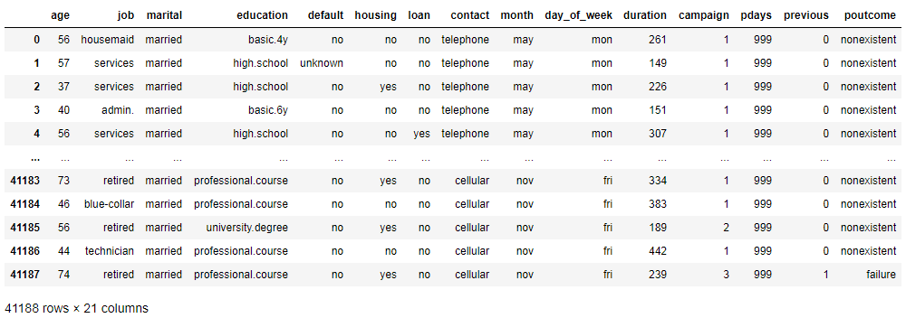

# Bank-Term-Deposit-Predictor
Goal is to predict if a client will subscribe a term deposit (variable y in dataset).

## Dataset Attribute Information:
#### Bank client data:
* Age (numeric)
* Job : type of job (categorical: 'admin.', 'blue-collar', 'entrepreneur', 'housemaid', 'management', 'retired', 'self-employed', 'services', 'student', 'technician', 'unemployed', 'unknown')
* Marital : marital status (categorical: 'divorced', 'married', 'single', 'unknown' ; note: 'divorced' means divorced or widowed)
* Education (categorical: 'basic.4y', 'basic.6y', 'basic.9y', 'high.school', 'illiterate', 'professional.course', 'university.degree', 'unknown')
* Default: has credit in default? (categorical: 'no', 'yes', 'unknown')
* Housing: has housing loan? (categorical: 'no', 'yes', 'unknown')
* Loan: has personal loan? (categorical: 'no', 'yes', 'unknown')
#### Related with the last contact of the current campaign:
* Contact: contact communication type (categorical:
'cellular','telephone')
* Month: last contact month of year (categorical: 'jan', 'feb', 'mar',
…, 'nov', 'dec')
* Dayofweek: last contact day of the week (categorical:
'mon','tue','wed','thu','fri')
* Duration: last contact duration, in seconds (numeric). Important
note: this attribute highly affects the output target (e.g., if
duration=0 then y='no'). Yet, the duration is not known before a call
is performed. Also, after the end of the call y is obviously known.
Thus, this input should only be included for benchmark purposes and
should be discarded if the intention is to have a realistic
predictive model.
#### Other attributes:
* Campaign: number of contacts performed during this campaign and for
this client (numeric, includes last contact)
* Pdays: number of days that passed by after the client was last
contacted from a previous campaign (numeric; 999 means client was not
previously contacted)
* Previous: number of contacts performed before this campaign and for
this client (numeric)
* Poutcome: outcome of the previous marketing campaign (categorical:
'failure','nonexistent','success')
#### Social and economic context attributes
Emp.var.rate: employment variation rate - quarterly indicator
(numeric)
* Cons.price.idx: consumer price index - monthly indicator (numeric)
* Cons.conf.idx: consumer confidence index - monthly indicator
(numeric)
* Euribor3m: euribor 3 month rate - daily indicator (numeric)
* Nr.employed: number of employees - quarterly indicator (numeric)
#### Output variable (desired target):
* y - has the client subscribed a term deposit? (binary: 'yes', 'no')

#### Source:
Dataset from : http://archive.ics.uci.edu/ml/datasets/Bank+Marketing#

# 1. Data Preprocessing

```python
#Importing dataset as dataframe

raw_data = pd.read_csv('bank-additional-full.csv', sep = ';')

pd.options.display.max_columns = None
pd.options.display.max_rows = 10

display(raw_data)
```


```python
#copy dataframe
df = raw_data.copy()

#dropping the following columns as we want to know what personal 
#information leads to purchase of term deposit and not how successful the previous campaigns were
df = df.drop(['contact','month','day_of_week','duration','campaign', 'pdays', 'previous', 'poutcome'], axis=1)

#changing column 'y' to 'purchase' so it looks more intiutive
df = df.rename(columns={"y": "purchased"})

```

```python
# check if there are any other unwanted values such as 'unknown' or missing values in the following columns

print("Unique values of 'default':" , df['default'].unique())
print("Unique values of 'housing':" , df['housing'].unique())
print("Unique values of 'loan':" , df['loan'].unique())
print("Unique values of 'purchased':" , df['purchased'].unique())
print("Unique values of 'job':" , df['job'].unique())
print("Unique values of 'marital':" , df['marital'].unique())
print("Unique values of 'education':" , df['education'].unique())

```
Output:

```
Unique values of 'default': ['no' 'unknown' 'yes']
Unique values of 'housing': ['no' 'yes' 'unknown']
Unique values of 'loan': ['no' 'yes' 'unknown']
Unique values of 'purchased': ['no' 'yes']
Unique values of 'job': ['housemaid' 'services' 'admin.' 'blue-collar' 'technician' 'retired'
 'management' 'unemployed' 'self-employed' 'unknown' 'entrepreneur'
 'student']
Unique values of 'marital': ['married' 'single' 'divorced' 'unknown']
Unique values of 'education': ['basic.4y' 'high.school' 'basic.6y' 'basic.9y' 'professional.course'
 'unknown' 'university.degree' 'illiterate']
```

```python
#dropping unknown values
df = df[df.default != 'unknown']
df = df[df.housing != 'unknown']
df = df[df.loan != 'unknown']
df = df[df.education != 'unknown']
df = df[df.job != 'unknown']
df = df[df.marital != 'unknown']

# check if there are any other unwanted values such as 'unknown' or missing values in the following columns

print("Unique values of 'default':" , df['default'].unique())
print("Unique values of 'housing':" , df['housing'].unique())
print("Unique values of 'loan':" , df['loan'].unique())
print("Unique values of 'purchased':" , df['purchased'].unique())
print("Unique values of 'job':" , df['job'].unique())
print("Unique values of 'marital':" , df['marital'].unique())
print("Unique values of 'education':" , df['education'].unique())

```

Output:
```
Unique values of 'default': ['no' 'yes']
Unique values of 'housing': ['no' 'yes']
Unique values of 'loan': ['no' 'yes']
Unique values of 'purchased': ['no' 'yes']
Unique values of 'job': ['housemaid' 'services' 'admin.' 'technician' 'blue-collar' 'unemployed'
 'retired' 'entrepreneur' 'management' 'student' 'self-employed']
Unique values of 'marital': ['married' 'single' 'divorced']
Unique values of 'education': ['basic.4y' 'high.school' 'basic.6y' 'professional.course' 'basic.9y'
 'university.degree' 'illiterate']
```
