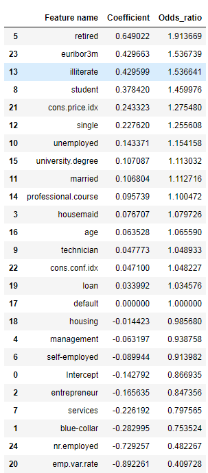

# Bank-Term-Deposit-Predictor
Goal is to predict if a client will subscribe a term deposit (variable y in dataset).

## Dataset Attribute Information:
#### Bank client data:
* Age (numeric)
* Job : type of job (categorical: 'admin.', 'blue-collar', 'entrepreneur', 'housemaid', 'management', 'retired', 'self-employed', 'services', 'student', 'technician', 'unemployed', 'unknown')
* Marital : marital status (categorical: 'divorced', 'married', 'single', 'unknown' ; note: 'divorced' means divorced or widowed)
* Education (categorical: 'basic.4y', 'basic.6y', 'basic.9y', 'high.school', 'illiterate', 'professional.course', 'university.degree', 'unknown')
* Default: has credit in default? (categorical: 'no', 'yes', 'unknown')
* Housing: has housing loan? (categorical: 'no', 'yes', 'unknown')
* Loan: has personal loan? (categorical: 'no', 'yes', 'unknown')
#### Related with the last contact of the current campaign:
* Contact: contact communication type (categorical:
'cellular','telephone')
* Month: last contact month of year (categorical: 'jan', 'feb', 'mar',
…, 'nov', 'dec')
* Dayofweek: last contact day of the week (categorical:
'mon','tue','wed','thu','fri')
* Duration: last contact duration, in seconds (numeric). Important
note: this attribute highly affects the output target (e.g., if
duration=0 then y='no'). Yet, the duration is not known before a call
is performed. Also, after the end of the call y is obviously known.
Thus, this input should only be included for benchmark purposes and
should be discarded if the intention is to have a realistic
predictive model.
#### Other attributes:
* Campaign: number of contacts performed during this campaign and for
this client (numeric, includes last contact)
* Pdays: number of days that passed by after the client was last
contacted from a previous campaign (numeric; 999 means client was not
previously contacted)
* Previous: number of contacts performed before this campaign and for
this client (numeric)
* Poutcome: outcome of the previous marketing campaign (categorical:
'failure','nonexistent','success')
#### Social and economic context attributes
Emp.var.rate: employment variation rate - quarterly indicator
(numeric)
* Cons.price.idx: consumer price index - monthly indicator (numeric)
* Cons.conf.idx: consumer confidence index - monthly indicator
(numeric)
* Euribor3m: euribor 3 month rate - daily indicator (numeric)
* Nr.employed: number of employees - quarterly indicator (numeric)
#### Output variable (desired target):
* y - has the client subscribed a term deposit? (binary: 'yes', 'no')

#### Source:
Dataset from : http://archive.ics.uci.edu/ml/datasets/Bank+Marketing#

# 1. Data Preprocessing

### We start by importing the dataset as dataframe
```python
#Importing dataset as dataframe

raw_data = pd.read_csv('bank-additional-full.csv', sep = ';')

pd.options.display.max_columns = None
pd.options.display.max_rows = 10

display(raw_data)
```


```python
#copy dataframe
df = raw_data.copy()
```

### Dropping the following columns as we want to know what personal information leads to purchase of term deposit and not how successful the previous campaigns were. Followed by renaming column 'y' to 'purchase' so it looks more intiutive
```python
df = df.drop(['contact','month','day_of_week','duration','campaign', 'pdays', 'previous', 'poutcome'], axis=1)

#changing column 'y' to 'purchase' so it looks more intiutive
df = df.rename(columns={"y": "purchased"})

```
### Check if there are any other unwanted values such as 'unknown' or missing values in the following columns
```python
print("Unique values of 'default':" , df['default'].unique())
print("Unique values of 'housing':" , df['housing'].unique())
print("Unique values of 'loan':" , df['loan'].unique())
print("Unique values of 'purchased':" , df['purchased'].unique())
print("Unique values of 'job':" , df['job'].unique())
print("Unique values of 'marital':" , df['marital'].unique())
print("Unique values of 'education':" , df['education'].unique())

```
Output:

```
Unique values of 'default': ['no' 'unknown' 'yes']
Unique values of 'housing': ['no' 'yes' 'unknown']
Unique values of 'loan': ['no' 'yes' 'unknown']
Unique values of 'purchased': ['no' 'yes']
Unique values of 'job': ['housemaid' 'services' 'admin.' 'blue-collar' 'technician' 'retired'
 'management' 'unemployed' 'self-employed' 'unknown' 'entrepreneur'
 'student']
Unique values of 'marital': ['married' 'single' 'divorced' 'unknown']
Unique values of 'education': ['basic.4y' 'high.school' 'basic.6y' 'basic.9y' 'professional.course'
 'unknown' 'university.degree' 'illiterate']
```

### From above output, there are 'unknown' values which are not good for our model training. These rows have to be dropped.
```python
df = df[df.default != 'unknown']
df = df[df.housing != 'unknown']
df = df[df.loan != 'unknown']
df = df[df.education != 'unknown']
df = df[df.job != 'unknown']
df = df[df.marital != 'unknown']

# check if there are any other unwanted values such as 'unknown' or missing values in the following columns
print("Unique values of 'default':" , df['default'].unique())
print("Unique values of 'housing':" , df['housing'].unique())
print("Unique values of 'loan':" , df['loan'].unique())
print("Unique values of 'purchased':" , df['purchased'].unique())
print("Unique values of 'job':" , df['job'].unique())
print("Unique values of 'marital':" , df['marital'].unique())
print("Unique values of 'education':" , df['education'].unique())

```

Output:
```
Unique values of 'default': ['no' 'yes']
Unique values of 'housing': ['no' 'yes']
Unique values of 'loan': ['no' 'yes']
Unique values of 'purchased': ['no' 'yes']
Unique values of 'job': ['housemaid' 'services' 'admin.' 'technician' 'blue-collar' 'unemployed'
 'retired' 'entrepreneur' 'management' 'student' 'self-employed']
Unique values of 'marital': ['married' 'single' 'divorced']
Unique values of 'education': ['basic.4y' 'high.school' 'basic.6y' 'professional.course' 'basic.9y'
 'university.degree' 'illiterate']
```

### Next we have to encode categorical data in order for my model to be trained
```python
df['default'] = df['default'].map({'yes':1, 'no':0})
df['housing'] = df['housing'].map({'yes':1, 'no':0})
df['loan'] = df['loan'].map({'yes':1, 'no':0})
df['purchased'] = df['purchased'].map({'yes':1, 'no':0})

```

### Some categories in the data can be grouped together

```python
#we will group 'basic.4y' 'high.school' 'basic.6y' and 'basic.9y' as one category


df.loc[df['education'] == 'basic.4y', 'education'] = 'high.school'
df.loc[df['education'] == 'basic.6y', 'education'] = 'high.school'
df.loc[df['education'] == 'basic.9y', 'education'] = 'high.school'
```

### Checking if columns are correctly processed such as correct mapping and no extra values.
```python
print("Unique values of 'default':" , df['default'].unique())
print("Unique values of 'housing':" , df['housing'].unique())
print("Unique values of 'loan':" , df['loan'].unique())
print("Unique values of 'purchased':" , df['purchased'].unique())
print("Unique values of 'job':" , df['job'].unique())
print("Unique values of 'marital':" , df['marital'].unique())
print("Unique values of 'education':" , df['education'].unique())
```
Output:
```
Unique values of 'default': [0 1]
Unique values of 'housing': [0 1]
Unique values of 'loan': [0 1]
Unique values of 'purchased': [0 1]
Unique values of 'job': ['housemaid' 'services' 'admin.' 'technician' 'blue-collar' 'unemployed'
 'retired' 'entrepreneur' 'management' 'student' 'self-employed']
Unique values of 'marital': ['married' 'single' 'divorced']
Unique values of 'education': ['high.school' 'professional.course' 'university.degree' 'illiterate']
```

### Getting dummies for column 'job', 'education' and 'marital'. drop_first used to avoid dependency during model training
```python
job_columns = pd.get_dummies(df['job'], drop_first = True)
education_columns = pd.get_dummies(df['education'], drop_first = True)
marital_columns = pd.get_dummies(df['marital'], drop_first = True)
```

### Now that encoding is done, previous categorical columns can be dropped.
```python
#drop column 'job', 'marital' and 'education' as it will not be used anymore

df_without_job = df.drop(['job'], axis=1)
df_without_job_marital = df_without_job.drop(['marital'], axis=1)
df_without_job_marital_education = df_without_job_marital.drop(['education'], axis=1)
```

### Concatenating all the required columns
```python
df_with_dummies = pd.concat([df_without_job_marital_education, job_columns, marital_columns, education_columns], axis=1)
```

### The dataframe columns are messy now. We will have to reorder ensuring our target(aka purchase) is at the right most column

```python
# Get the list of all the column names
df_with_dummies.columns.values
```
Output:
```
array(['age', 'default', 'housing', 'loan', 'emp.var.rate',
       'cons.price.idx', 'cons.conf.idx', 'euribor3m', 'nr.employed',
       'purchased', 'blue-collar', 'entrepreneur', 'housemaid',
       'management', 'retired', 'self-employed', 'services', 'student',
       'technician', 'unemployed', 'married', 'single', 'illiterate',
       'professional.course', 'university.degree'], dtype=object)
```
```python
#reorder columns such that purchase is the last column

column_names_reordered = ['blue-collar', 'entrepreneur', 'housemaid',
       'management', 'retired', 'self-employed', 'services', 'student',
       'technician', 'unemployed', 'married', 'single', 'illiterate',
       'professional.course', 'university.degree', 'age', 'default', 'housing', 'loan', 'emp.var.rate',
       'cons.price.idx', 'cons.conf.idx', 'euribor3m', 'nr.employed',
       'purchased']

df_reordered = df_with_dummies[column_names_reordered]
```

### Before training the model, we have to check if the dataframe is balance
```python
#check if data is balance

print('Total number of purchases: ', df_reordered['purchased'].sum())
print('Total number of rows:  ', df_reordered['purchased'].shape[0])
print('Percentage of customers purchasing term deposit: ', df_reordered['purchased'].sum()/df_reordered['purchased'].shape[0] *100, '%')
```
Output:
```
Total number of purchases:  3859
Total number of rows:   30488
Percentage of customers purchasing term deposit:  12.65743899239045 %
```

### From the above result, 12%. Using this imbalanced data will cause the model to fit the majority class better to improve the overall accuracy. we do not want that. So we will have to balance the data
```python
#shuffle dataframe

from sklearn.utils import shuffle

df_reordered = shuffle(df_reordered)
df_reordered.reset_index(inplace=True, drop=True)

#remove excess 0s
zero_counter = 0
counter = 0
indices_to_remove =[]


for index, row in df_reordered.iterrows():
    if row['purchased'] == 0:
        zero_counter+=1
        if zero_counter >= df_reordered['purchased'].sum():
            indices_to_remove.append(index)
        
df_balanced = df_reordered.drop(indices_to_remove)
df_balanced.reset_index(inplace=True, drop=True)

#check if targets are balance (approx. 50%)

print(df_balanced['purchased'].sum())
print(df_balanced['purchased'].shape[0])
print(df_balanced['purchased'].sum()/df_balanced['purchased'].shape[0])
```
Output:
```
3859
7717
0.5000647920176234
```
### Now we separate unscaled inputs and targets
```python
unscaled_inputs = df_balanced.iloc[:,:-1]
targets = df_balanced['purchased']
```

### Standardize unscaled inputs other than dummies
```python
from sklearn.preprocessing import StandardScaler
cols_to_norm = ['age','emp.var.rate', 'cons.price.idx', 
                'cons.conf.idx', 'euribor3m','nr.employed']

unscaled_inputs[cols_to_norm] = StandardScaler().fit_transform(unscaled_inputs[cols_to_norm])

scaled_inputs = unscaled_inputs.copy()
```
# 2. Model Training

### Start by splitting data into train and test data
```python
from sklearn.model_selection import train_test_split

x_train, x_test, y_train, y_test = train_test_split(scaled_inputs, targets, #train_size = 0.8, 
                                                                            test_size = 0.2, random_state = 20)
```

### Checking if the data is properly splitted
```python
print (x_train.shape, y_train.shape)
print (x_test.shape, y_test.shape)
```
Output:
```
(6173, 24) (6173,)
(1544, 24) (1544,)
```

### Model training
```python
# import the LogReg model from sklearn
from sklearn.linear_model import LogisticRegression

# create a logistic regression object
reg = LogisticRegression()

# fit our train inputs that is basically the whole training part of the machine learning
reg.fit(x_train,y_train)

# assess the train accuracy of the model
print('Train accuracy: ',reg.score(x_train,y_train), '\n')

# get the intercept (bias) of our model
print('Model intercept: ',reg.intercept_, '\n')

#get the coefficient of our model
print('Model coefficient: ',reg.coef_,  '\n')
```
Output:
```
Train accuracy:  0.725417139154382 

Model intercept:  [-0.14279162] 

Model coefficient:  [[-0.28299482 -0.16563471  0.07670685 -0.06319707  0.64902246 -0.08994387
  -0.22619193  0.37842006  0.04777322  0.14337138  0.10680356  0.22762018
   0.42959896  0.09573891  0.10708743  0.06352828  0.         -0.01442343
   0.03399157 -0.89226125  0.24332263  0.04710026  0.4296626  -0.72925715]] 
```
### Creating a summary table
```python
# save the names of the columns in an ad-hoc variable
feature_name = unscaled_inputs.columns.values

# creates summary table for visualization
summary_table = pd.DataFrame (columns=['Feature name'], data = feature_name)

# add the coefficient values to the summary table
summary_table['Coefficient'] = np.transpose(reg.coef_)


#summary table move all indices by 1
summary_table.index = summary_table.index + 1

# add the intercept at index 0
summary_table.loc[0] = ['Intercept', reg.intercept_[0]]

# sort the df by index
summary_table = summary_table.sort_index()

# create a new Series called: 'Odds ratio' which will show the odds ratio of each feature
summary_table['Odds_ratio'] = np.exp(summary_table.Coefficient)

#displays all rows
pd.options.display.max_rows = None

#sort by column 'Odds_ratio'
summary_table = summary_table.sort_values('Odds_ratio', ascending=False)

# display the summary table
summary_table
```
Output:


# 3. Model Testing
### Assess the test accuracy of the model\
```python
reg.score(x_test,y_test)
```
Output:
```
0.7435233160621761
```

### Find the predicted probabilities of each class the first column shows the probability of a particular observation to be 0, while the second one - to be 1
```python
predicted_proba = reg.predict_proba(x_test)
predicted_proba
```
Output:
```
array([[0.55444773, 0.44555227],
       [0.76163189, 0.23836811],
       [0.71105208, 0.28894792],
       ...,
       [0.72974067, 0.27025933],
       [0.71671029, 0.28328971],
       [0.15718826, 0.84281174]])
```
